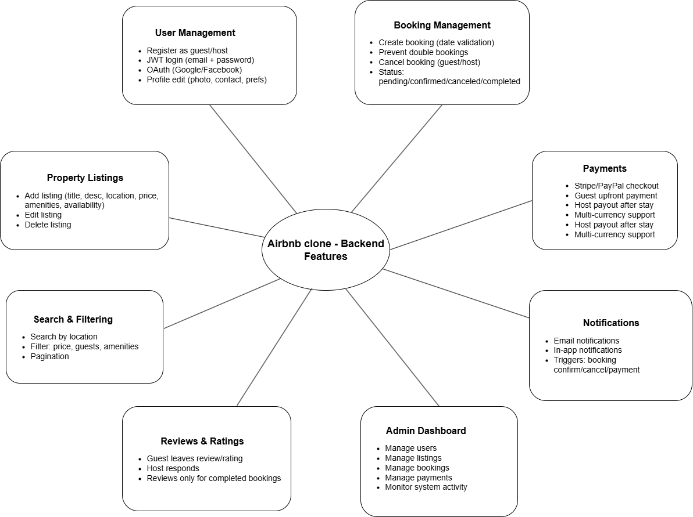

# Airbnb Clone Backend – Features and Functionalities

This document and diagram list the core features the backend must support for the Airbnb Clone.

## Features by Category

### User Management
- Register as guest/host
- JWT login (email + password)
- OAuth (Google/Facebook)
- Profile edit (photo, contact, preferences)

### Property Listings
- Add listing (title, description, location, price, amenities, availability)
- Edit listing
- Delete listing

### Search & Filtering
- Search by location
- Filter by price, guests, amenities
- Pagination

### Booking Management
- Create booking with date validation
- Prevent double bookings
- Cancel booking (guest/host)
- Booking status: pending, confirmed, canceled, completed

### Payments
- Stripe/PayPal checkout
- Guest upfront payment
- Host payout after stay
- Multi-currency support

### Reviews & Ratings
- Guest leaves review and rating
- Host responds to review
- Reviews restricted to completed bookings

### Notifications
- Email and in-app notifications
- Triggers: booking confirmations, cancellations, payment updates

### Admin Dashboard
- Manage users, listings, bookings, payments
- Monitor system activity

## Diagram

The diagram below visualizes the categories and their features.

